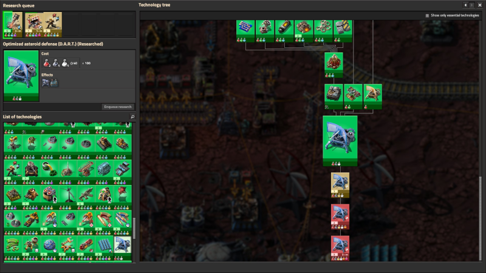
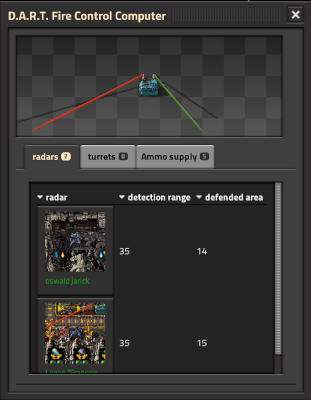

# Dangerous Asteroids Radar Tracking (D.A.R.T)

An optimized asteroid defense

## Features
Are you also sick of wasting ammunition on asteroids that fly safely past your platforms? 

Then D.A.R.T. might be the solution for you. It continuously monitors the space around your platforms, controls the 
connected ammo turrets, and prioritizes the approaching asteroids. Those that are heading directly toward your platforms
and are likely to collide with them are attacked, while the others are ignored, saving you tons of ammunition.

## Components
D.A.R.T consist of two special devices. The central fire control computer (FCC) and a specialized variant of radar -
miniaturized with reduced power consumption and only usable on platforms. To use them, you have to research the D.A.R.T. 
technology.

## Usage
To protect a platform with D.A.R.T., you have to build a FCC and at least one dart-radar (exact number depends on size and 
shape of your platform to cover it complete) addtionally to your turrets. Communication between FCC and dart-radars uses a top secret military 
technique, called Light Ubiquity Architecture 😉 and needs no further interaction by you. As soon as FCC and dart-radars 
are placed on a platform the connection between them will be established. 

To control ammo turrets with D.A.R.T., you have to connect them with red or green wire with the FCC.

## Configuration
Configuration can be done by simply opening the FCC 

All (= all on platform) dart-radars and ammo-turrets are accessible through this. Unconnected ammo-turrets or turrets 
with ambiguous circuit network conditions will be shown with according warnings.

To use D.A.R.T, it must be configured (per platform). This has to be done in these steps (not necessarily in this order)

- set the size of the defended area (recommended). The defended area consist of (overlapping) circles with the dart-radars as center 

- set the detection range too (optional)

- set the circuit network conditions in all connected ammo turrets by switching to the "turrets"-tab 

  and clicking on the turret to be configured (mandatory)

**Hint**
D.A.R.T. activates a turret by setting its circuit network condition to 1.

# Have fun

# Supported languages in this version:
  - deutsch (de)
  - english (en)
  - español (es-ES)
  - français (fr)
  - português (pt-BR)
----
